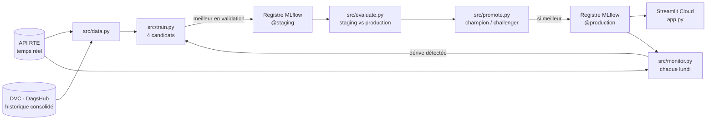
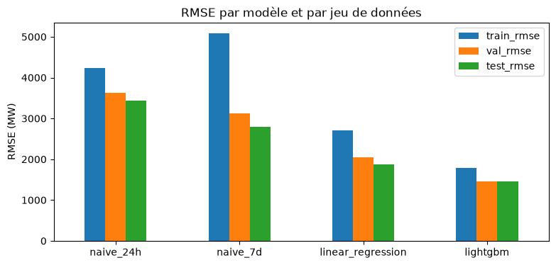
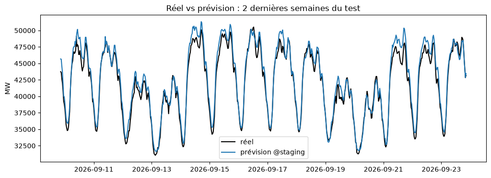
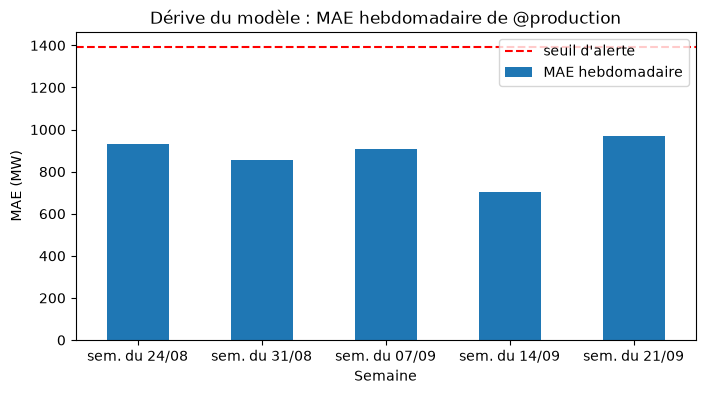

# Prévision de consommation électrique day-ahead

Prévision des 48 demi-heures du lendemain de la consommation électrique France (RTE éCO2mix), avec une chaîne MLOps complète : données versionnées, entraînement traçable, registre de modèles, promotion automatique, surveillance de la dérive et réentraînement.

**Stack :** Python · pandas · scikit-learn · LightGBM · MLflow (DagsHub) · DVC (DagsHub) · GitHub Actions · Streamlit Cloud

## Architecture



| Étape | Outil | Où le voir |
|---|---|---|
| Versionnage des données | DVC (historique) + instantané des données récentes loggé dans MLflow | `dvc.lock`, onglet *Artifacts* du run `training` |
| Suivi des expériences | MLflow : run parent `training`, un run enfant par modèle | DagsHub → Experiments |
| Registre de modèles | alias `@staging` / `@production`, tags `data_version`, `git_commit`, `val_rmse`, `test_rmse` | DagsHub → Models |
| Paramètres | `params.yaml`, suivi par DVC (`dvc params diff`) | |
| CI | lint → tests → pipeline DVC | GitHub → Actions → *CI* |
| Entraînement continu | données → entraînement → évaluation → promotion | GitHub → Actions → *Entraînement* |
| Monitoring | PSI, KS, MAE hebdomadaire ; déclenche l'entraînement en cas de dérive | GitHub → Actions → *Monitoring*, onglet *Monitoring drift* de l'app |

## Démarche data science

Les notebooks racontent la démarche dans l'ordre et importent le code de `src/` (aucun code dupliqué) :

| Notebook | Question | Décision |
|---|---|---|
| [01_exploration](notebooks/01_exploration.ipynb) | À quoi ressemble la consommation ? | saisonnalités jour / semaine / année → calendrier en heure de Paris ; autocorrélation à 24 h et 7 j → lags |
| [02_features_split](notebooks/02_features_split.ipynb) | Quelles variables, quel découpage ? | lags ≥ 24 h uniquement (pas de fuite en day-ahead) ; découpage chronologique train / validation / test |
| [03_modelisation](notebooks/03_modelisation.ipynb) | Quel modèle ? | naïfs < régression linéaire < LightGBM ; choix sur la validation, pas sur le test |
| [04_tuning_overfitting](notebooks/04_tuning_overfitting.ipynb) | Comment régler sans sur-apprendre ? | `TimeSeriesSplit`, grille loggée dans MLflow, courbes train / validation, early stopping → modèle le plus régularisé |
| [05_analyse_erreurs](notebooks/05_analyse_erreurs.ipynb) | Où le modèle se trompe-t-il ? | jours fériés et lendemains → piste d'amélioration n°1 |
| [06_drift](notebooks/06_drift.ipynb) | Quand réentraîner ? | référence saisonnière (même période N-1) ; seuil PSI calibré sur l'historique |

### Choix clés

- **Pas de `lag_1`** : la veille, la consommation de demain 17 h 30 est inconnue. Tous les lags font au moins 24 h, la journée se prédit d'un coup.
- **Découpage temporel** : test = 3 derniers mois (données RTE temps réel), validation = mois précédent. Aucun mélange aléatoire.
- **Références naïves conservées** : un modèle qui ne bat pas « demain = aujourd'hui » n'a pas d'intérêt.
- **Régression linéaire** avec calendrier one-hot : modèle simple et interprétable, point de comparaison honnête.
- **Contrôle du sur-apprentissage** : RMSE train / validation / test loggées pour chaque modèle, validation croisée temporelle, early stopping, `min_child_samples` élevé.
- **Champion / challenger** : un nouveau modèle ne remplace la production que s'il fait mieux sur le même jeu de test.

### Résultats (test : 23/06 → 23/09/2026)

| Modèle | RMSE train | RMSE validation | RMSE test | MAE test | R² test |
|---|---|---|---|---|---|
| Naïf 24 h | 4 239 | 3 619 | 3 437 | 2 307 | 0,66 |
| Naïf 7 jours | 5 092 | 3 116 | 2 791 | 2 130 | 0,78 |
| Régression linéaire | 2 701 | 2 047 | 1 872 | 1 404 | 0,90 |
| **LightGBM** | 1 778 | 1 462 | **1 460** | **1 094** | **0,94** |

La RMSE train est plus élevée que la validation car le train contient tous les hivers (consommation et erreurs absolues plus fortes) ; la comparaison à périodes égales se fait par validation croisée (notebook 04).

La v2 entraînée par ce pipeline (RMSE 1 460) n'a **pas** été promue : la v1 en production fait 1 421 sur le même test. La règle champion / challenger a joué son rôle.





## Structure

```text
app.py                     Application Streamlit (prévision, performance, monitoring)
params.yaml                Paramètres (découpage, LightGBM, seuils de monitoring)
dvc.yaml / dvc.lock        Pipeline DVC : prepare_data → fetch_recent → train → evaluate
src/config.py              Chemins, connexion MLflow, tags de version
src/prepare_data.py        Fichier brut RTE → séries nationale et régionales
src/data.py                API RTE temps réel, chargement, découpage temporel
src/features.py            Calendrier (heure de Paris) et lags
src/models.py              Modèles naïfs, régression linéaire, LightGBM, métriques
src/train.py               Entraînement des candidats → @staging
src/evaluate.py            @staging vs @production sur le test
src/promote.py             Promotion champion / challenger → @production
src/monitor.py             Dérive des données et du modèle
notebooks/                 Démarche data science (01 à 06)
reports/                   Métriques et graphiques du dernier passage
tests/                     Tests pytest
.github/workflows/         ci.yml, train.yml, monitoring.yml
```

## Utilisation

### Installation

```powershell
python -m venv .venv
.\.venv\Scripts\Activate.ps1
pip install -r requirements-dev.txt
```

### Connexion DagsHub

```powershell
dvc remote modify --local dagshub user adem.debbahi
dvc remote modify --local dagshub password TON_TOKEN_DAGSHUB

$env:MLFLOW_TRACKING_URI = "https://dagshub.com/adem.debbahi/conso_energie_prediction.mlflow"
$env:MLFLOW_TRACKING_USERNAME = "adem.debbahi"
$env:MLFLOW_TRACKING_PASSWORD = "TON_TOKEN_DAGSHUB"
```

Sans `MLFLOW_TRACKING_URI`, tout est enregistré en local dans `mlflow.db`.

### Pipeline

```powershell
dvc pull              # données depuis DagsHub
dvc repro             # données RTE récentes → entraînement → évaluation
python -m src.promote # promotion si meilleur que la production
python -m src.monitor # contrôle de dérive
dvc push
```

Pour tester d'autres hyperparamètres : modifier `params.yaml`, puis `dvc repro` et `dvc params diff`.

### GitHub Actions

Ajouter dans **Settings > Secrets and variables > Actions** :

- `DAGSHUB_USERNAME` : `adem.debbahi`
- `DAGSHUB_TOKEN` : token DagsHub

| Workflow | Déclenchement | Jobs |
|---|---|---|
| `ci.yml` | chaque push / PR | lint (ruff) → tests (pytest) → graphe DVC |
| `train.yml` | manuel, changement de `params.yaml` ou `src/`, ou appelé par le monitoring | données → entraînement → évaluation → promotion |
| `monitoring.yml` | chaque lundi à 6 h UTC, ou manuel | dérive → réentraînement si nécessaire |

Chaque workflow écrit un résumé (tableaux de métriques) sur la page du run.

### Streamlit Cloud

Fichier `app.py`, secrets dans **Settings > Secrets** :

```toml
MLFLOW_TRACKING_URI = "https://dagshub.com/adem.debbahi/conso_energie_prediction.mlflow"
MLFLOW_TRACKING_USERNAME = "adem.debbahi"
MLFLOW_TRACKING_PASSWORD = "TON_TOKEN_DAGSHUB"
```

L'application charge `models:/conso_energie_day_ahead@production` et propose :

- **Prévision rapide** : une demi-heure à partir de trois curseurs ;
- **Prévoir demain** : 48 demi-heures à partir des données RTE récentes, d'un CSV ou de l'exemple ;
- **Performance modèle** : registre, comparaison train / validation / test, diagnostics de chaque version ;
- **Monitoring drift** : dernier contrôle de dérive et historique.

## Pistes d'amélioration

1. Variable jour férié / pont (principale source d'erreur, notebook 05).
2. Température prévue pour le lendemain (Open-Meteo), en utilisant la prévision et non l'observation.
3. Prévision par région à partir de `data/eco2mix_regional.csv`.
